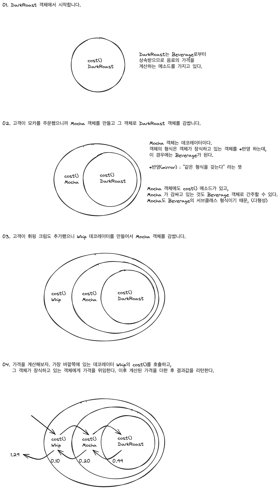

## 데코레이터 패턴

>Decorator Pattern 으로 객체에 추가 요소를 동적으로 더할 수 있다.
>데코레이터를 사용하면 서브클래스를 만들 때보다 훨씬 유연하게 기능을 확장할 수 있다.

## 초대형 커피 전문점, 스타버즈

스타버즈는 초대형 커피 전문점으로 유명하다. 빠르게 성장하면서 다양한 음료를 모두 포괄하는 주문 시스템을 미처 갖추지 못했다.

고객은 커피를 주문할 때 우유, 두유, 모카를 추가하고 그 위에 휘핑 크림을 얹기도 한다. 각각 추가할 때마다 커피 가격이 올라가야 하기에 주문 시스템을 구현할 때 이런 점을 모두 고려해야 한다.

## OCP 살펴보기

> OCP
>
> 클래스 확장에는 열려 있어야 하지만, 변경에는 닫혀 있어야 한다.

우리의 목표는 기존 코드를 건드리지 않고 확장으로 새로운 행동을 추가하는 것이다. 이 목표를 달성하면 유연하고 튼튼한 디자인을 만들 수 있을 것이다.

## 데코레이터 패턴 살펴보기

상속을 써서 음료가격과 첨가가격을 합해서 총 가격을 산출하는 방법은 그리 좋지 않은 방법이다. 클래스가 어마어마하게 많아지거나, 일부 클래스에서는 적합하지 않은 기능을 추가해야 하는 문제가 있다.

다른 방법을 한번 생각해보자.

특정 음료에서 시작해서 첨가물로 그 음료를 **장식(decorate)** 해 보자. 예를 들어 어떤 고객이 모카와 휘핑크림을 추가한 다크 로스트 커피를 주문한다면 다음과 같이 작성할 수 있다.

1. DarkRoast 객체를 가져온다.
2. Mocha 객체로 장식한다.
3. Whip 객체로 장식한다.
4. cost() 메서드를 호출한다. 이때 첨가물의 가격을 계산하는 일은 해당 객체에게 위임한다.

## 주문 시스템에 데코레이터 패턴 적용하기



내용 정리

- 데코레이터의 슈퍼클래스는 자신이 장식하고 있는 객체의 슈퍼클래스와 같다.
- 한 객체를 여러 개의 데코레이터로 감쌀 수 있다.
- 데코레이터는 자신이 감싸고 있는 객체와 같은 슈퍼클래스를 가지고 있기에 원래 객체(싸여있는 객체)가 들어갈 자리에 데코레이터 객체를 넣어도 상관 없다.
- **데코레이터는 자신이 장식하고 있는 객체에게 어떤 행동을 위임하는 일 말고도 추가작업을 수행할 수 있다.**
- 객체는 언제든지 감쌀 수 있으므로 실행 중에 필요한 데코레이터를 마음대로 적용할 수 있다.

### 사무실 옆자리에서 들려온 이야기

- 데코레이터 패턴에서는 상속을 사용해 형식을 맞추지만, 행동은 구성을 통해 얻는다
- 객체 구성(인스턴스 변수로 다른 객체를 저장)을 사용하기 때문에 첨가물을 다양하게 추가해도 유연성을 잃지 않는다
- 구성을 활용하면 실행 중에 데코레이터를 마음대로 조합해서 사용할 수 있다
- 데코레이터 패턴에서는 인터페이스보다 추상 클래스를 사용하는 것이 더 적합할 수 있다

## 커피 주문 시스템 코드 만들기

먼저 기본 클래스와 데코레이터 추상 클래스를 만들자

```typescript
abstract class Beverage {  
  description: string = "제목 없음"  
  
  getDescription() {  
    return this.description;  
  }  
  
  abstract cost(): number;  
}  
  
abstract class CondimentDecorator extends Beverage {  
  beverage: Beverage  
  
  abstract getDescription(): string  
}
```

## 음료 코드 구현하기

이제 기본 음료 클래스를 만들어보자

```typescript
class Espresso extends Beverage {  
  constructor() {  
    super();  
    this.description = "에스프레소"  
  }  
  
  cost(): number {  
    return 4000;  
  }  
}  
  
class HouseBlend extends Beverage {  
  constructor() {  
    super();  
    this.description = "하우스 블렌드 커피"  
  }  
  
  cost(): number {  
    return 3800;  
  }  
}
```

## 첨가물 코드 구현하기

지금까지는 추상 구성요소(Beverage)와 구상 구성 요소(HouseBlend), 그리고 추상 데코레이터(CondimentDecorator)까지 만들었다. 이제 구상 데코레이터를 구현해보자.

```typescript
class Mocha extends CondimentDecorator {  
  constructor(beverage: Beverage) {  
    super();  
    this.beverage = beverage  
  }  
  
  getDescription(): string {  
    return `${this.beverage.getDescription()}, 모카`;  
  }  
  
  cost(): number {  
    return this.beverage.cost() + 100;  
  }  
}
```

## 커피 주문 시스템 코드 테스트

```typescript
function StarbuzzCoffee() {  
  const beverage1 = new Espresso();  
  console.log(`${beverage1.getDescription()} ${beverage1.cost()}`);
  
  let beverage2 = new HouseBlend();  
  beverage2 = new Mocha(beverage2);  
  beverage2 = new Mocha(beverage2);  
  console.log(`${beverage2.getDescription()} ${beverage2.cost()}`);  
}

StarbuzzCoffee();
```

