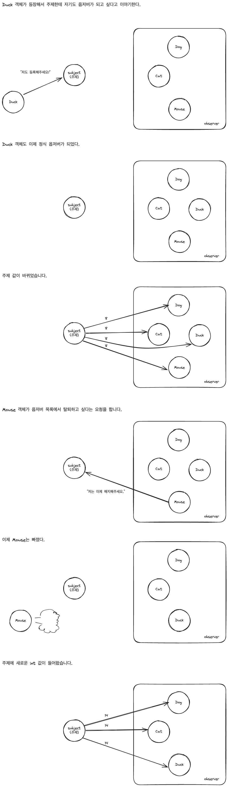

## 옵저버 패턴

>  객체의 상태가 바뀌면 그 객체에 의존하는 다른 객체에게 연락이 가고 자동으로 내용이 갱신되는 방식으로 일대다(one-to-many) 의존성을 정의한다.

## 업무 계약 체결서

인터넷 기반 기상 스테이션을 구축하는 프로젝트를 진행한다. 이 프로젝트는 다음 요구사항을 가진다:

- WeatherData 객체를 기반으로 구축
- 3개의 디스플레이 항목(현재 조건, 기상 통계, 기상 예보)을 화면에 표시
- 최신 측정치를 수신하고 실시간으로 갱신
- 날씨 디스플레이를 확장 가능하게 설계

## 기상 모니터링 애플리케이션 알아보기

Weather-O-Rama 시스템의 세 가지 요소

1. 기상 스테이션: 실제 기상 정보를 수집하는 물리 장비
2. WeatherData 객체: 기상 스테이션으로부터 오는 정보를 추적하는 객체
3. 디스플레이 장비: 사용자에게 기상 조건을 보여주는 장치
	- 습도 센서
	- 온도 센서
	- 기압 센서

## WeatherData 클래스 살펴보기

```typescript
class WeatherData {  
  // 온도, 습도, 기압 값을 리턴하는 메서드  
  // WeatherData 객체가 갱신된 정보를 알아서 가져온다고 가정  
  // 갱신된 값을 가져올 때마다 measurementsChanged() 메서드가 호출된다
  public getTemperature() {}  
  public getHumidity() {}  
  public getPressure() {}  
  
  // 기상 관측값이 갱신될 때마다 이 메소드가 호출된다
  public measurementsChanged() {  
    // 코드가 들어갈 자리  
  }  
}
```

## 구현 목표

디스플레이를 구현하고 새로운 값이 들어올 때마다 디스플레이를 업데이트해야 한다. 첫 번째 구현 시도는 다음과 같다.

```typescript
public measurementsChanged() {  
  const temp = getTemperature();  
  const humidity = getHumidity();  
  const pressure = getPressure();  
    
  // 각 디스플레이를 갱신  
  currentConditionDisplay.update(temp, humidity, pressure);  
  statisticsDisplay.update(temp, humidity, pressure);  
  forecastDisplay.update(temp, humidity, pressure);  
}
```

이 구현은 다음과 같은 문제점을 가진다:

- 구체적인 구현에 의존해 프로그래밍하고 있다
- 새로운 디스플레이 항목이 추가될 때마다 코드를 변경해야 한다
- 실행 중에 디스플레이 항목을 추가하거나 제거할 수 없다
- 바뀌는 부분을 캡슐화하지 않았다

## 원칙으로 추가 코드 살펴보기

`currentConditionDisplay`, `statisticsDisplay`, `forecastDisplay`
- 구체적인 구현에 맞춰서 코딩했으므로 프로그램을 고치지 않고는 다른 디스플레이 항목을 추가하거나 제거할 수 없다  

`update(temp, humidity, pressure)`
- 바뀔 수 있는 부분이므로 캡슐화 해야한다.  
- 디스플레이 항목과 데이터를 주고받는데 적어도 공통도니 인터페이스를 사용하고 있다. 모두 update 메소드를 가지고 있다.

## 옵저버 패턴 이해하기

옵저버 패턴은 신문 구독 과정을 생각하면 이해하기 쉽다.

- 신문사(주제, Subject)가 신문을 발행한다
- 구독자(옵저버, Observer)가 신문을 구독하고 새로운 신문이 나올 때마다 받는다
- 구독을 원하지 않으면 해지할 수 있다

## 옵저버 패턴의 작동 원리



## 옵저버 패턴의 기본 구조

```typescript
// 주제를 나타내는 인터페이스
interface Subject {  
  registerObserver(o: Observer): void;  
  removeObserver(o: Observer): void;  
  notifyObserver(): void;  
}  

// 옵저버가 될 가능성이 있는 객체는 이 인터페이스를 구현해야 한다
interface Observer {  
  update(): void;  
}  

// 주제 역할을 하는 구상 클래스
class ConcreteSubject implements Subject {  
  public registerObserver() {}  
  public removeObserver() {}  
  public notifyObserver() {}  
  
  // 주제 클래스의 상태 관리 메소드
  getState() {}  
  setState() {}  
}  

// 옵저버 구현 클래스
class ConcreteObserver implements Observer {  
  public update() {}  
  // 기타 옵저버용 메소드
}
```

## 느슨한 결합(Loose Coupling)의 위력

옵저버 패턴은 느슨한 결합의 좋은 예이다. 

>느슨한 결합
>
>객체들이 상호작용할 수는 있지만, 서로 잘 모르는 관계를 의미한다. 이를 활용하면 유연성이 좋아진다.

옵저버 패턴의 느슨한 결합 특성

1. 주제는 옵저버가 특정 인터페이스(Observer)를 구현한다는 것만 안다
2. 옵저버는 언제든지 추가하거나 제거할 수 있다
3. 새로운 형식의 옵저버를 추가할 때도 주제를 변경할 필요가 없다
4. 주제와 옵저버는 서로 독립적으로 재사용할 수 있다
5. 주제나 옵저버가 바뀌어도 서로에게 영향을 미치지 않는다

>디자인 원칙
>
>상호작용하는 객체 사이에는 가능하면 느슨한 결합을 사용해야 한다.

## 기상 스테이션 구현하기

```typescript
interface Subject {  
  // 옵저버 등록 및 제거
  registerObserver(o: Observer): void;  
  removeObserver(o: Observer): void;  
  // 상태 변경 시 옵저버에게 알림
  notifyObserver(): void;  
}  

interface Observer {  
  // 모든 옵저버는 update() 메서드를 구현해야 함
  update(temp: number, humidity: number, pressure: number): void;  
}  

interface DisplayElement {  
  // 디스플레이를 화면에 표시할 때 호출
  display(): void;  
}
```

## Subject 인터페이스 구현하기

```typescript
class WeatherData implements Subject {  
  private observer: Observer[];  
  private temperature: number;  
  private humidity: number;  
  private pressure: number;  
  
  constructor() {  
    this.observer = [];  
  }  
  
  registerObserver(o: Observer) {  
    this.observer.push(o);  
  }  
  
  removeObserver(o: Observer) {  
    this.observer = this.observer.filter(item => item !== o);  
  }  
  
  notifyObserver() {  
    this.observer.forEach(o => o.update(this.temperature, this.humidity, this.pressure));  
  }  
  
  measurementsChanged() {  
    this.notifyObserver();  
  }  
  
  setMeasurements(temp: number, humidity: number, pressure: number) {  
    this.temperature = temp;  
    this.humidity = humidity;  
    this.pressure = pressure;  
    this.measurementsChanged();  
  }  
  
  getTemperature() { return this.temperature; }  
  getHumidity() { return this.humidity; }  
  getPressure() { return this.pressure; }  
}
```

## 디스플레이 요소 구현하기

```typescript
class CurrentConditionsDisplay implements Observer, DisplayElement {  
  private temperature: number;  
  private humidity: number;  
  private weatherData: WeatherData;  
  
  constructor(weatherData: WeatherData) {  
    this.weatherData = weatherData;  
    weatherData.registerObserver(this);  
  }  
  
  update(temperature: number, humidity: number, pressure: number) {  
    this.temperature = temperature;  
    this.humidity = humidity;  
    this.display();  
  }  
  
  display() {  
    console.log(`현재 상태: 온도 ${this.temperature}F, 습도 ${this.humidity}%`);  
  }  
}
```

## 기상 스테이션 테스트

```typescript
function WeatherStation() {  
  const weatherData = new WeatherData();  
  
  const currentConditionsDisplay = new CurrentConditionsDisplay(weatherData);  
  const statisticsDisplay = new StatisticsDisplay(weatherData);  
  const forecastDisplay = new ForecastDisplay(weatherData);  
  
  weatherData.setMeasurements(80, 60, 30.4);  
  weatherData.setMeasurements(82, 70, 29.2);  
  weatherData.setMeasurements(78, 90, 29.2);  
}

WeatherStation();
```
